# **PigKeeper Game Tracker**

Pig is a dice game where multiple players participate with the goal of exceeding 100 total points. Multiple games could be played in which an overall winner is determined for the set by the number of points the player has won by, not by the amount of wins. Keeping track of all of the scores of each of the players can be challenging, so we created the PigKeeper Game Tracker to keep track of the scoring.

The PigKeeper Game Tracker is an Android phone application that allows users to easily input scores, player names, establish a turn order, select players who are "sitting out" a game, and enable specific game rules. Although there are various versions of Pig, the PigKeeper Game Tracker focuses on the two-dice Pig variant.

# **Table of Contents**

# **Installation**

# **Usage**

To begin a new game:

1. Enable desired game rules by tapping on the Rules button. You will be directed to the Rules screen where you can select the Consequences for each Special Turn Case. Once the game rules have been set to your liking, tap on the Back button to turn to the main home screen. 

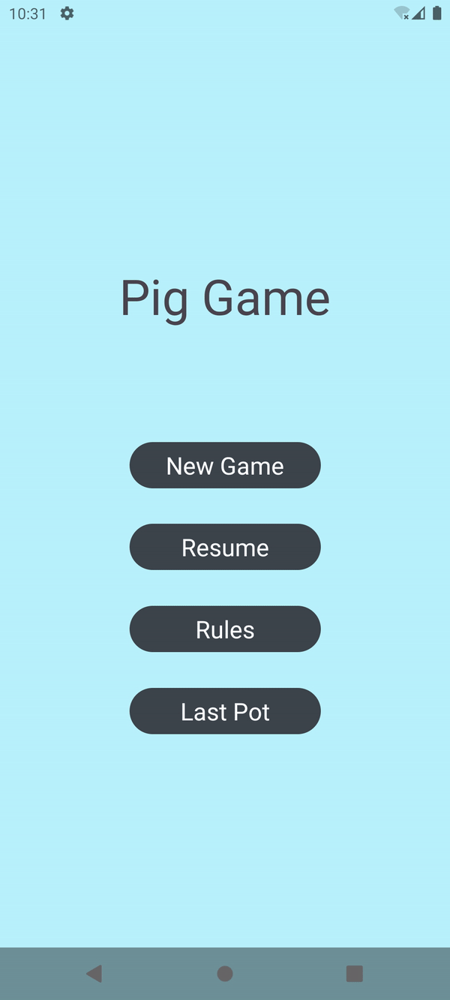

2. Tap on the New Game button to begin a new game. You will be directed to the New Players screen where you will input the name of a player. Tap Add Player to add them into the game. Repeat until the number of players is desired. 

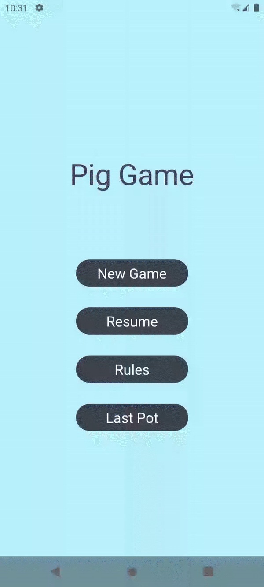

3. Tap Start Round to begin the game. You will be directed to the Turn Order screen where you will establish the Turn Order by tapping each player's name in the order you would like for them to play in. Their turn number is indicated to the left of their name once you tapped on their name. 

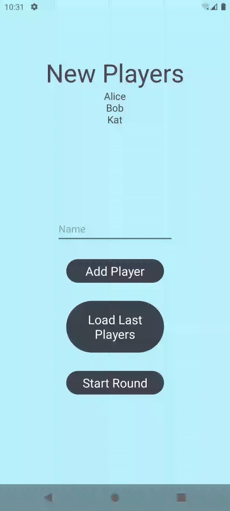

4. If you would like a player to sit out for the given round, tap on Sit Out followed by the player's name that will sit out. Their name will be "grayed out" to indicate that they are sitting out for the round.

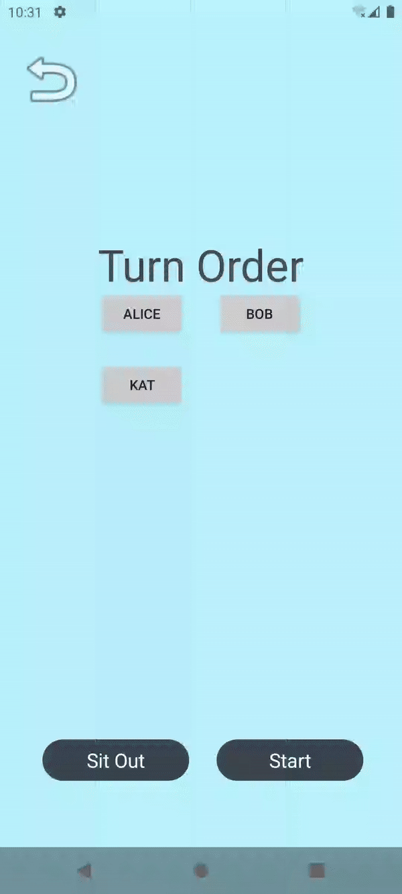

5. Tap on Start to begin the game. You will be directed to the Roll screen. As you are playing Pig, input the scores by tapping on a die face. When a missroll occurs, tap on the `X` button. To redo the roll, tap on the curved arrow button. Once a player has finished rolling their dice, tap on the green `✓` button to input their score. To move onto the next player, tap on the green `→` and their turn will begin. 

6. To view All Scores, tap on the blue card on the top of the screen. All Players scores will be displayed. Tap on Back to return to the Roll screen.

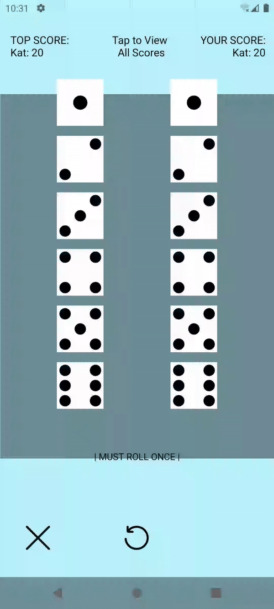

7. Once a player exceeds 100 total points, every other player will have one more turn in order to exceed the top player’s score. If anyone exceeds the score and becomes the new leader, the cycle continues and every other player will again have one more turn to exceed the new player’s top score. If no one is able to surpass the top score within their one turn, the winner is declared, and a new screen will pop up indicating the player that won and their score. Tap on See Pot to view the Pot Scores and Round Scores. Tap on Next Round if you wish to continue the game. Tap on End Game to end the game. 

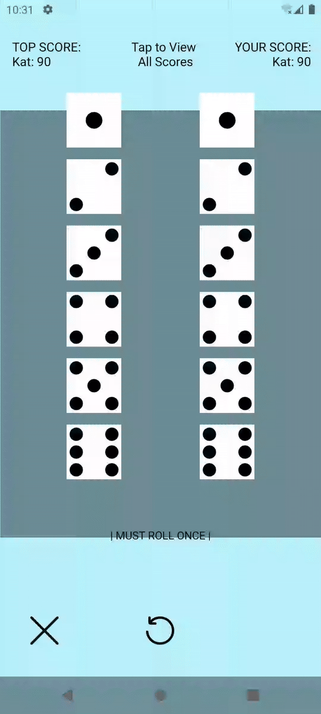

To view the scores from the previous pot:

1. On the main home screen, tap on Last Pot. You will be directed to the Last Pot screen where the scores of the previous Pot are displayed. Tap on Back to return to the main home screen. 

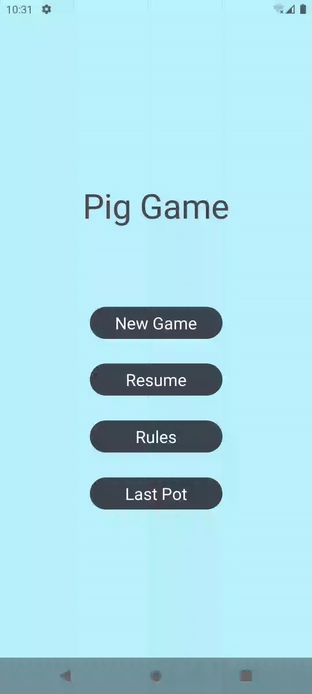

To begin a new game with the same players from the previous game:

1. Follow the steps to begin a new game. When directed to the New Players screen, tap on Load` `Last Players to retrieve the players from the previous game. 

2. Tap on Start Round and play the game as usual.

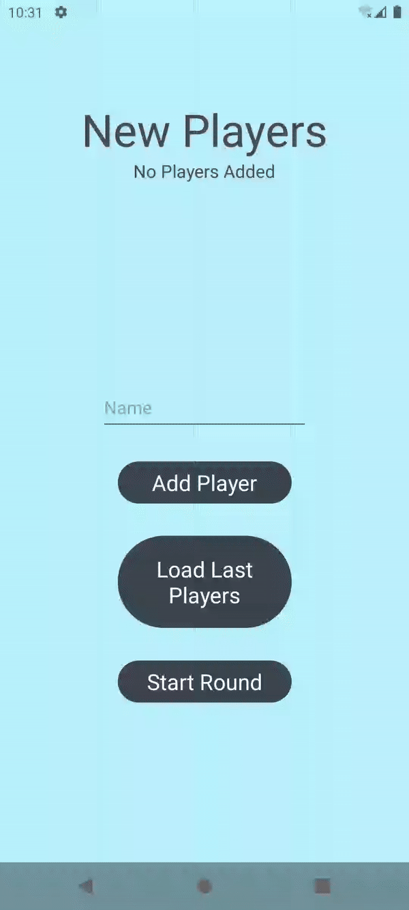

To resume a game after exiting the application:

1. When the application has been closed, reopen the application.

2. On the main home screen, tap on Resume. You will be directed to the last screen that was open before the app was closed.  

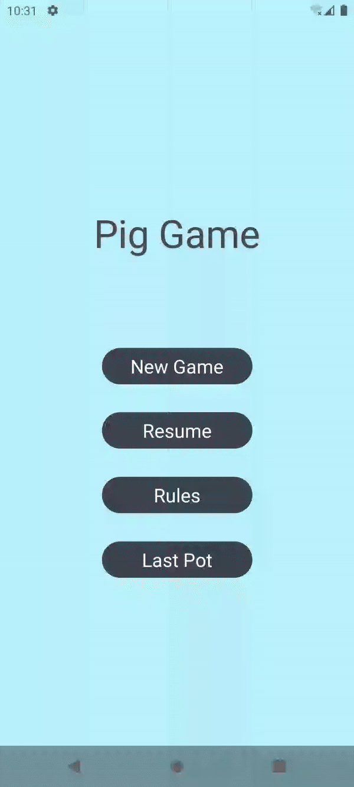

# **Files**

## **Kotlin Files**

### **AllScoresActivity.kt**

-Responsible for displaying the All Scores Screen (activity_all_scores.xml), using a hashmap from GlobalData.kt called globalVariable.nameToScore to retrieve the player names and score pairs. Contains functionality for the Back button, which starts the RollActivity (Roll Screen).

### **GlobalData.kt**

-All data that must persist between screens/activities and throughout the lifetime of the application running (including some data that must persist even when the application is closed and reopened) is stored in GlobalData. This includes various maps, booleans, strings, integers, and objects. Contains the functions, onCreate(), loadData(), and saveData(). 

The onCreate() function will initialize the default rules of the game and the shared preferences. The loadData() function loads in players and sets the values for various variables. It also retrieves the rules Map, the currentRuleCase, and the Consequences. The saveData() function edits the shared preferences and saves any relevant data into Global data. 

### **LastPotActivity.kt**

-Displays Last Pot Screen (activity_last_pot.xml) using a hashmap from GlobalData.kt called nameToPot to retrieve the player name and overall pot score pairs. Contains functionality for the Back button, which starts MainActivity (Main Menu Screen).

### **MainActivity.kt**

-Displays the Main Menu Screen (activity_main.xml) and sets the four buttons (buttonPlay, buttonResume, buttonRules, and buttonLastPot) and their respective functionality. Contains functions newGame(), resumeGame(), and onPause().
The newGame() function clears the nameToScore hashmap, clearing the names and scores of players from any previous game. It sets booleans endedGameSession and endedGameRound to True, and the NewPlayersActivity (New Players Screen). 
The resumeGame() function will resume any currently ongoing game if the game session is not ended (if there is no currently ongoing game, the resumeGame() function does nothing). It starts the NewPlayerActivity if a round has already ended. Otherwise, it will start the RollActivity, since a round is currently underway. 
The onPause() function saves all relevant data to globalData.

### **NewPlayersActivity.kt**

-Displays the New Players Screen (activity_new_players.xml). Sets up relevant textViews and buttons. The buttonAddPlayer button adds the name currently in the EditText field called inputName to the namesArray and then clears the inputName field. ButtonStartRound starts the TurnOrderActivity (Turn Order Screen) if the namesArray is not empty, meaning the user cannot continue without adding a name. ButtonLoadLastPlayers uses function loadLastPlayers() to load players from the previous game (if any) into the namesArray. Function onPause() saves all relevant data to GlobalData. 

### **PotScreenActivity.kt**

-Displays the Pot Screen (activity_pot_screen_xml). Sets up values for the round scores and overall pot scores of all players. Sets up the Next and End Game buttons, which start the MainActivity (Main Menu Screen) and NewPlayersActivity (New Players Screen) respectively. Function onPause() saves all relevant data to GlobalData.

### **RollActivity.kt**

-Displays the Roll Screen (activity_roll.xml). Keeps track of the current roll screen by setting necessary variables (booleans, integers, strings). Sets the currentPlayer to be the first in the turn order, which means currentPlayer is the one who is rolling when RollActivity is started. Gets all items from the layout file and hides the ones that must be initially hidden (Next button and Undo button). Also initializes the consequence “Must Roll Once” since the current player is required to roll at least once. Sets up the button for the top tab, which starts the AllScoresActivity (All Scores Screen). Sets up functionality of the 12 die face buttons by setting the selected dice, updating the dice buttons, and updating the current player score to reflect the dice buttons selected. Set up the nextRoll button, nextPlayer button, and undoRoll button, and their respective functionality. Consequences of special turn cases are added or removed from view depending on the selected dice buttons and rules. Also contains functions for updating the Pot, restoring variables, and saving data to GlobalData. 

### **RulesActivity.kt**

-Displays the Rules Screen (activity_rules.xml). Responsible for the customizable rules feature. Stores the special rule cases in a mutable map, with the Special Rule Cases being the keys (type enum) and lists of Consequences being the values (type list of enums). Contains onClickListener functions for each button on the activity_rules.xml screen. These functions edit the values of the map by adding or removing Consequences from the selected list associated with a given Special Rule Case. This map is passed through via GlobalData to be used throughout the rest of the application and to remain persistent. 

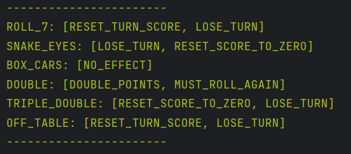

Example map, with Special Turn Cases (keys) and their associated List of Consequences (values)

### **SettingsActivity.kt**

-Displays the Settings Screen (activity_settings.xml). Sets up buttons, textViews, and imageView for the Computer Vision Test Feature. Allows for the use of phone camera (via camera imports) to take photos in a virtual space. This feature is currently in testing, and not polished or meant to be a part of the main PigKeeper game. 

### **TurnOrderActivity.kt**

-Displays the Turn Order Screen (activity_turn_order.xml). Sets up a map for whether a player is sitting out or not, as well as sets up Sit Out and Start buttons along with their respective functionality. Creates an array of buttons for the players in the game (this array of buttons is used by the user to create turn order and select which players are sitting out of the current round). Function onPause() saves all relevant data to GlobalData. 

### **WinScreenActivity.kt**

-Displays the Win Screen (activity_win_screen.xml). Sets up textView that displays the winner of the round (topPlayer) which is determined by which player has the highest score (topScore). Function onPause() saves all relevant data to GlobalData.

&nbsp;

## **Xml Layout Files (/main/res/layout)**

### **activity_all_scores.xml**

Layout file for All Scores Screen. Has the title “All Scores” at the top of the screen, and displays all players’ names and their respective scores in the TextView box below the title. Contains a single button, Back which takes the user back to the Roll Screen (activity_roll.xml). 

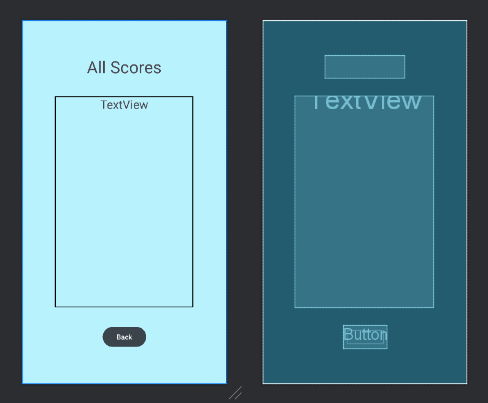

All Scores Screen and its components 

&nbsp;
### **activity_last_pot.xml**

Layout file for the Last Pot Screen. Has the title “Last Pot” at the top of the screen, and displays all the names’ and respective overall pot scores of the players from the previous game played. This screen is accessible from the Main Menu screen (activity_main.xml) via the Last Pot button. The Back button takes the user back to the Main Menu screen (activity_main.xml).

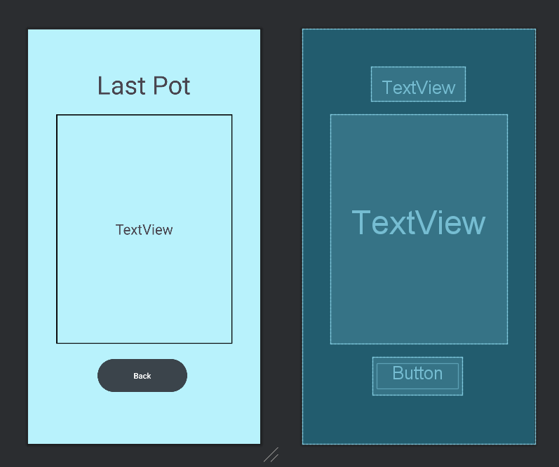

Last Pot Screen and its components 

&nbsp;
### **activity_main.xml**

Layout file for the Main Menu Screen, which is the first screen that the user will encounter upon opening the application. Has the title “Pig Game” and contains 4 buttons. The New Game button will start a brand new game of PigKeeper, and takes the user to the New Players Screen (activity_new_players.xml). The Resume button will take the user to the Roll Screen (activity_roll.xml), effectively resuming a current game of PigKeeper at the point in which it was left off. If there is no game that is currently underway, this button does nothing. The Rules button takes the user to the Rules Screen (activity_rules.xml). The Last Pot button takes the user to the Last Pot Screen (activity_last_pot.xml).

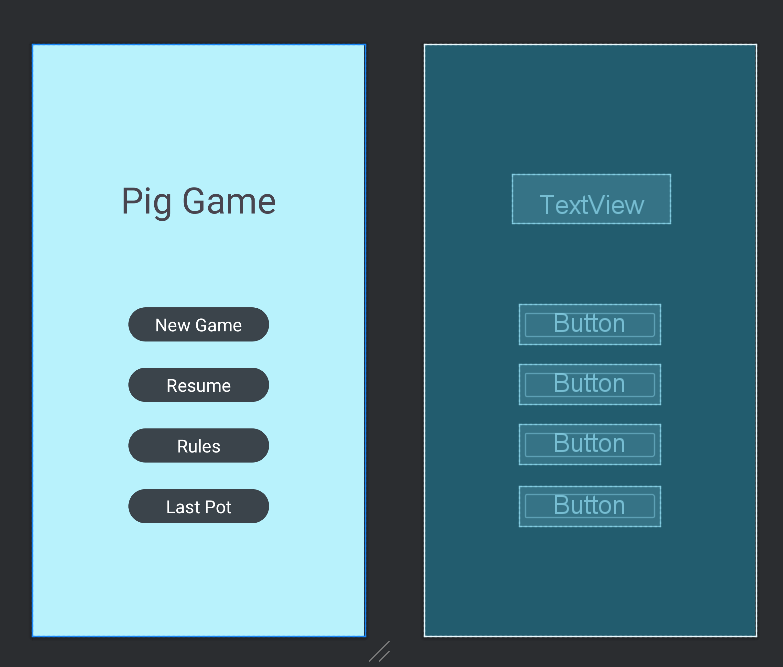

Main Menu Screen and its components 

&nbsp;
### **activity_new_players.xml**

Layout file for the New Players Screen. Has the title “New Players” at the top of the screen, and in the textview just below the title, shows the names of all players that have been added to the game (Shows text “No Players Added” if no players have been added yet). Has an inputName section where the user can type a name to add to the game. The Add Player button just below this adds the player name specified in the inputName to the game (the name is added to the textview just below the “New Players” title). The Load Last Players button will automatically add all the players from the previously played game to the player list of the current game. The Start Round button takes the user to the Turn Order Screen (activity_turn_order.xml).

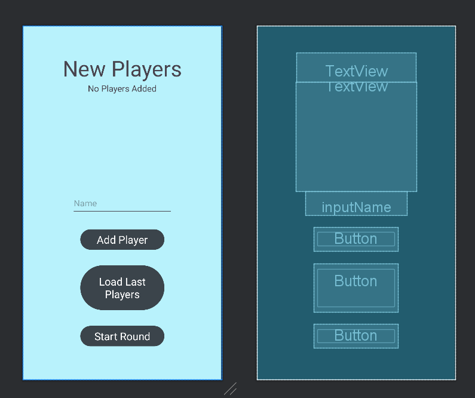

New Players Screen and its components 

&nbsp;
### **activity_pot_screen_xml**

Layout file for the Pot Screen. This screen is reached at the end of a round of play. Contains four textviews and two buttons. There are two columns on this screen. The left column is titled “Round Scores”, and displays players’ names and their respective scores for the latest round played. The right column is titled “Pot”, and displays players’ overall pot scores for the entire game. The End Game button ends the current game. The Next Round button will continue the current game by starting a new round. 

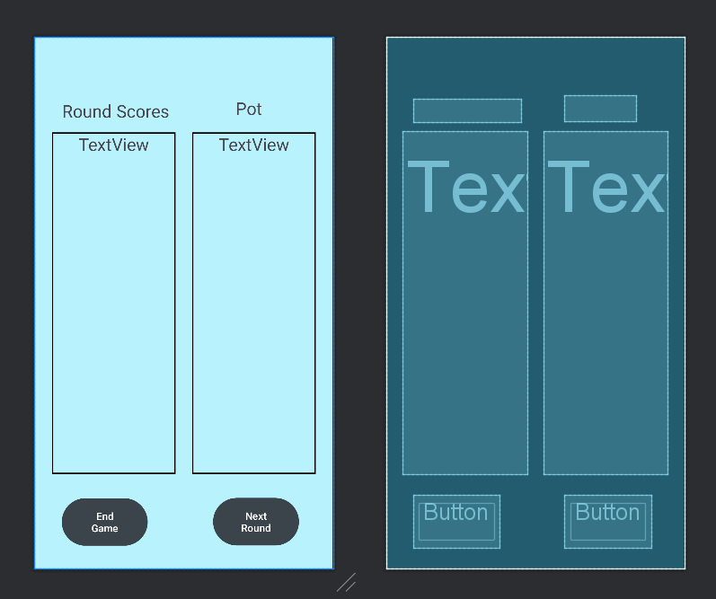

Pot Screen and its components 

&nbsp;
### **activity_roll.xml**

Layout file for the Roll Screen. The tab at the top contains three textviews. The top left text titled “TOP SCORE” displays the name and score of the player who currently has the highest score in the round. The top right text titled “YOUR SCORE” displays the name and score of the player who is currently rolling. The text at the middle of this top tab says “Tap to View All Scores.” This refers to the entire tab at the top, which acts as a clickable button that takes the user to the All Scores Screen (activity_all_scores.xml). The middle portion of the screen contains 12 buttons, which show images of the faces of 2 six-sided dice. The six buttons on the left represent a first die and the six buttons on the right represent the second die. Upon clicking any of these buttons, the selected button’s image will change to show the user that it has been selected. Only one face for each die can be selected at a time (Only one of the six buttons on the left, and only one of the six buttons on the right, can be selected at once). 
Once one button for each respective die is selected, All Roll Consequences of the impending roll are displayed at the bottom of the screen, and the “Confirm” button will appear at the bottom tab. At the button tab, there are three buttons, one of which (The “Confirm”/”Continue” button) is only displayed once two die face buttons have been selected). The “Off Table” button at the bottom left represents a roll in which one or both dice have been rolled off the table. The “Redo” button at the bottom center will revert the previous roll and allow the roll to be played once more. The button on the bottom right will change depending on circumstances. It will appear as the “Confirm” button once two die face buttons have been selected. Pressing the “Confirm” button will add the roll to the score and carry out any special rule consequences associated with the roll. After the “Confirm” button is pressed, it will change to the “Continue” button. Pressing the “Continue” button will end the current player’s turn. If the player is allowed to roll again, then they may opt out of pressing the “Continue” button and roll again instead. If the player is not allowed to roll again, their only option will be to press the “Continue” button. 
This screen goes to the Win Screen (activity_win_screen.xml) once a player wins the round. 

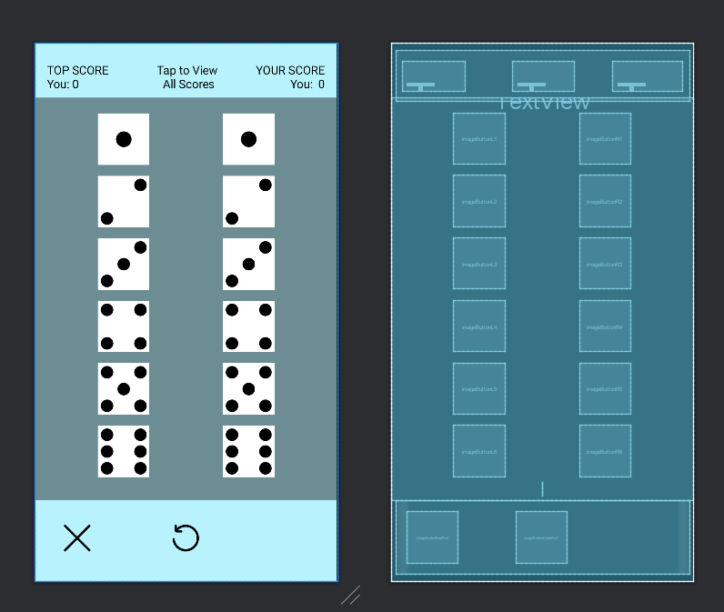

Roll Screen and its components 

&nbsp;
### **activity_rules.xml**

Layout file for the Rules Screen. Contains 13 buttons in total (6 Special Rule Cases, 6 Consequences, and 1 Back Button), and three TextViews (for titles). The left column of buttons, titled “Special Rule Cases” contains 6 buttons that specify certain roll conditions. Clicking any of these buttons will highlight the chosen button and their corresponding Consequence buttons on the right column of buttons (titled “Consequences”). Once a “Special Rule Case” button is selected, the user may customize the consequences of the given roll by selecting/deselecting the Consequence buttons on the right. Selected buttons will be green, while deselected buttons will be dark gray. The Back button returns the user to the Main Menu Screen (activity_main.xml).

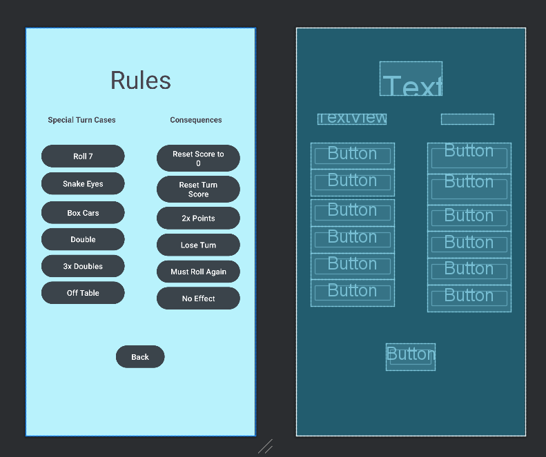

Rules Screen and its components 

&nbsp;
### **activity_settings.xml**

Layout file for the Rules Screen. Contains 2 buttons, 1 Back Button to return to Main Menu screen, and 1 Take Picture Button for the Computer Vision Dice Recognition test feature. The ImageView on the bottom of the screen displays the camera in the virtual space provided. Note: Dice Recognition is a test feature that is not polished or ready for use by players. 

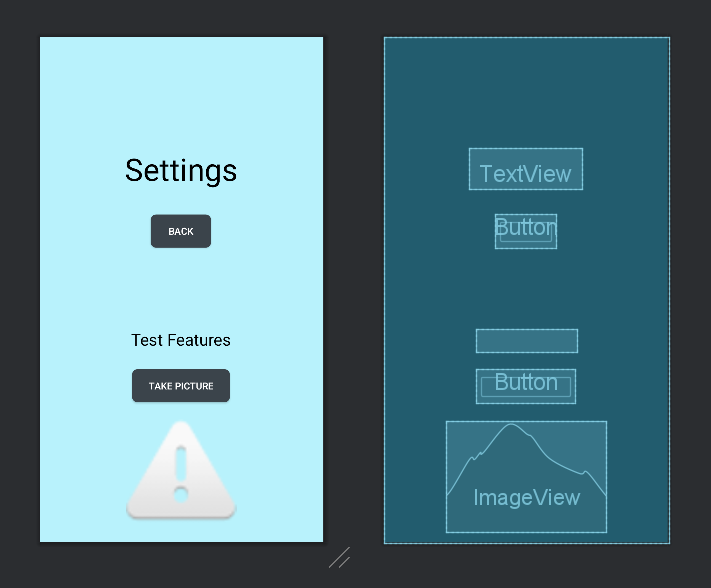

&nbsp;
### **activity_turn_order.xml**

Layout file for the Turn Order Screen. This screen appears after the user inputs player names in the New Players Screen (activity_new_players.xml). Beneath the title “Turn Order”, there is a set of buttons, each of which corresponds to a player in the game (The amount of buttons shown is dependent on the number of players in the game). The button on the bottom left of the screen is initially titled Sit Out, but once pressed will turn into the Player Order button. This button effectively decides the state of the screen. 
Initially, the screen is in the “Player Order” state. In this state,  the user can click the player name buttons to specify the order in which players will make their turns during the round. Clicking any of these buttons will insert a number next to the name on the selected button, indicating that player’s turn order (1 means that player will go first, 2 means they will go second, etc). 
Once the user presses the Sit Out button, the state of the screen changes to the “Sit Out” state. In this state, the user can click the player name buttons to specify which players will not be playing in the current round. The selected players will have their buttons shaded in a darker gray color, indicating that they are sitting out of the coming round. 
The Start button takes the user to the Roll Screen (activity_roll.xml), effectively starting the round. 

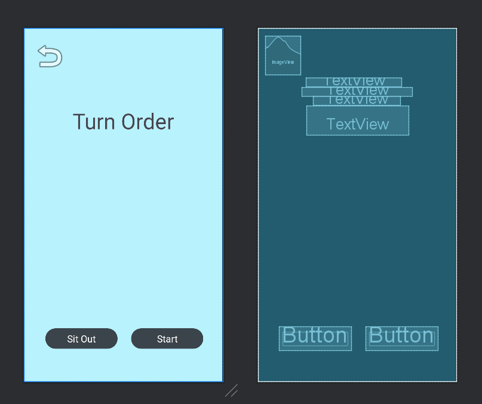

Turn Order Screen and its components 

&nbsp;
### **activity_win_screen.xml**

Layout file for the Win Screen. This screen is reached from the Roll Screen (activity_roll.xml) once a player has won the round. Contains a single textview at the center of the screen that displays a win message, showing the winner of the round. Also has a single button, See Pot, which takes the user to the Pot Screen (activity_pot_screen_xml). 

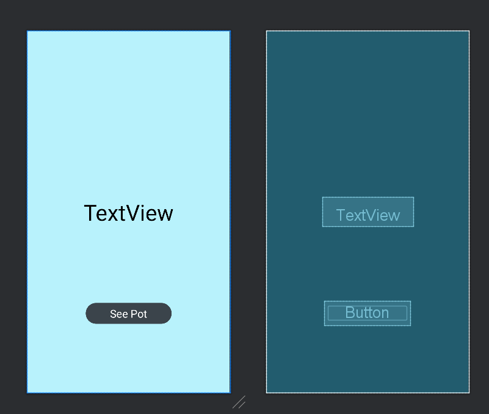

Win Screen and its components 

# **Testing**

# **Credits**

This software uses the following technologies:

* Android Studio (Hedgehog)
* Kotlin
