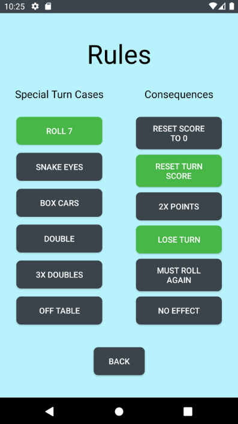

## How to Play PigKeeper

&nbsp; 

### 2-10 Players 

### General Gameplay:

PigKeeper is a dice rolling game that can be played in groups of 2 to 10 players. The objective of the game is to be the first player to exceed 100 points in a round. Points are earned by rolling the dice and adding the roll to your score.  Simple, right? Once one player exceeds 100, every other player has one more chance to exceed the top player’s score. If no one is able to do so, the winner of the round is declared. If someone does exceed the top player’s score, they are the new top player and the cycle continues.

### Special Rules

There are some special rules that make the game more interesting. Certain roles will have special effects on your score. These rolls include:

-Rolling a **7**

-“**Snake Eyes**” (Rolling two 1’s) 

-“**Box Cars**” (Rolling two 6’s)

-Rolling a **double**

-Rolling three **doubles** in a row                                          

-Rolling a die **off the table**

&nbsp; 

What are the special effects for each roll? Well, that’s for you to decide! There are a total of 5 “Consequences” that can be triggered by getting one of the rolls above. These consequences include:

-Resetting your score to **0**

-Resetting your score back to what it was at the **beginning of the turn**

-**Double points** on this roll

-**Losing your turn**

-You MUST **roll again**

&nbsp; 

Here’s an example of a Rule you can set up. In this image, the Roll 7 button is selected. This means that the Consequences on the right are associated with Rolling a 7. The Consequences that have been selected are Reset Turn Score and Lose Turn.

This means that if you roll a 7, your score will reset to what it was at the beginning of your turn, and you will lose your turn! 
You can mix and match these rules however you like, with a few exceptions (some rules are logically mutually exclusive. For example, you can’t have the “Lose Turn” and “Must Roll Again”  rules enabled at once). 

When you make a roll, you may notice that you can roll again. In fact, you can roll as many times as you’d like until you lose your turn. The tricky part is that there is always a chance that you have an unfortunate roll and your score resets to 0! So don’t bite off more than you can chew.

&nbsp; 

### Scoring

PigKeeper is played in rounds. A Set is any number of rounds (you decide when to stop). Once a player wins a round, all Set Scores will be updated. Set Scores (or Total Score) are not just a sum of all your points across all the rounds. Set Scores are calculated as follows:

-If you WIN a round, you will gain the difference between your round score and your opponents’ round scores. For example, if you win with a score of 110, and your friend has a score of 90, you will GAIN 20 POINTS  to your Total Score for the Set.

-If you LOSE a round, you will lose the difference between the winner’s round score and your round score. If the winner of the round had a score of 110, and you ended with a score of 90, you will LOSE 20 POINTS from your Total Score for the Set. 

*You can think of it as “giving” the winner 20 points because you lost by 20 points. 

-This applies to ALL PLAYERS in the current round. So if the round ended like this:

| **PLAYERS** | Player A | Player B | Player C |
| ----- | ----- | ----- | ----- |
| **ROUND SCORE** | 110 | 90 | 80 |

&nbsp; 

Then:
Player A would GAIN 50 POINTS

Player B would LOSE 20 POINTS

Player C would LOSE 30 POINTS

The Total Score at the end of this round would be:

| **PLAYERS** | Player A | Player B | Player C |
| ----- | ----- | ----- | ----- |
| **TOTAL SCORE** | 50 | -20 | -30 |

&nbsp; 

Don’t worry if you’re losing! If you win in the later rounds, you’ll catch up in no time!
Be wary not to end a round with a Round Score of 0! If you end a round with a 0, you will owe the winner DOUBLE the points you would normally! For example, If the winner of the round has 110 points, and you have 0, you will lose 220 POINTS!

&nbsp; 

The overall winner of the set is the player who has the most points when you decide to end the set. 

