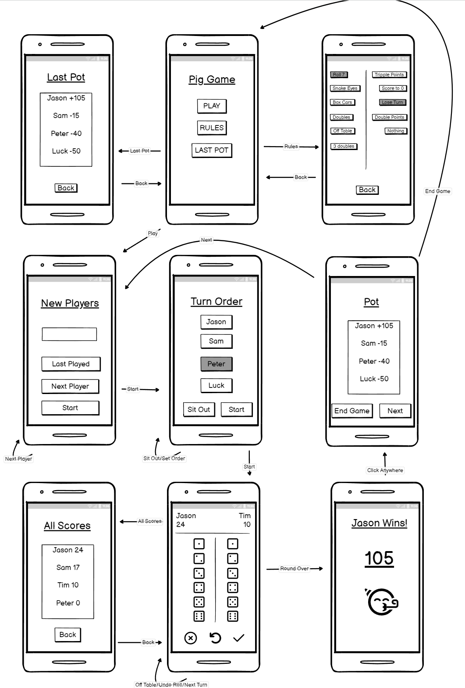

Requirements Document V1

Team #16

Khaiber Amin, Stephen Donecker, Jen Galicia, Wahad Latif

**Project: Android Application**

**Project Title: PigKeeper Game Tracker**

&nbsp;

**Introduction**

The Pig Game is a popular dice game that uses the rolls of two dice to try and get the most points. There are many unique rolls that require different sets of points to be scored, both positive and negative. The problem with current score keeping applications is that they increase or decrease in powers of 10, making it really hard to go change to the correct score. Current score keeping apps also lack features such as tracking overall scores across games, adjusting player ordering, and having special turn cases apply automatically.

Our app is made specifically for the Pig Game and seeks to solve these problems. We use a two dice input system so the phone can determine how the score should change based on the dice outcome alone. All calculations and special rules will be applied automatically, so the players only need to input their scores, streamlining the experience. 

&nbsp;

**Technology Survey**

-Front End

Option 1: Android Studio/Kotlin [CHOSEN]

<table>
  <tr>
   <td><strong>Pros</strong>
   </td>
   <td><strong>Cons</strong>
   </td>
  </tr>
  <tr>
   <td>
<ul>

<li>Android specific development features

<li>Kotlin is similar to Java, which we are familiar with

<li>Supports OpenCV (used for computer vision)
</li>
</ul>
   </td>
   <td>
<ul>

<li>No iOS support
</li>
</ul>
   </td>
  </tr>
</table>

Option 2: React Native

<table>
  <tr>
   <td><strong>Pros</strong>
   </td>
   <td><strong>Cons</strong>
   </td>
  </tr>
  <tr>
   <td>
<ul>

<li>Cross platform, meaning we use a single codebase

<li>Quick Testing Output Results
</li>
</ul>
   </td>
   <td>
<ul>

<li>General purpose app development can cause lack of features
</li>
</ul>
   </td>
  </tr>
</table>

Conclusion: We will use Android Studio/Kotlin as we will be focusing on making a quality Android product, and this choice will provide us with the proper features to make it happen. 

&nbsp;

-Project Management

Option 1: Jira Cloud [CHOSEN]

<table>
  <tr>
   <td><strong>Pros</strong>
   </td>
   <td><strong>Cons</strong>
   </td>
  </tr>
  <tr>
   <td>
<ul>

<li>Github integration

<li>Sprint support

<li>Backlog
</li>
</ul>
   </td>
   <td>
<ul>

<li>Some customization restrictions (subtasks can’t have subtasks)
</li>
</ul>
   </td>
  </tr>
</table>

Conclusion: We will be using Jira Cloud for project management as it provides the necessary framework to properly create, manage, and complete sprints to help us stay organized and on top of our tasks. It also supports GitHub integration. 

&nbsp;

-Computer Vision 

Option 1: OpenCV (or another image processing library)

<table>
  <tr>
   <td><strong>Pros</strong>
   </td>
   <td><strong>Cons</strong>
   </td>
  </tr>
  <tr>
   <td>
<ul>

<li>Can specify environment to handle images

<li>More control with better feedback

<li>Easy to learn
</li>
</ul>
   </td>
   <td>
<ul>

<li>Not good for uncontrolled environments

<li>May only work for dotted dice
</li>
</ul>
   </td>
  </tr>
</table>

Option 2: Machine Learning

<table>
  <tr>
   <td><strong>Pros</strong>
   </td>
   <td><strong>Cons</strong>
   </td>
  </tr>
  <tr>
   <td>
<ul>

<li>Extremely versatile

<li>Can use existing images
</li>
</ul>
   </td>
   <td>
<ul>

<li>Popular in python (we don't plan on using python)

<li>Steep learning curve

<li>Time consuming
</li>
</ul>
   </td>
  </tr>
</table>

Conclusion: As this decision hinges on future progress, we have yet to decide on which technology to use for Computer Vision. We can properly make a decision based on our results with the Alpha product.

&nbsp;

**Wireframes**

This is the wireframe for our application. It starts out with the main screen that can take you to “play”, “rules”, and “Last Pot”. The Rules takes you to a selection screen where you can either leave/view the default rules (chosen by the client) or you can change what each unique dice roll does. The Last Pot takes you to the ending earnings of the last game that was played. The Play button takes you to the player entry screen.

You start out at the “New Players” screen which gives you the option to enter the names of the people who are playing. You can instead hit the “Last Played” button which will use the players from the last game you played. After you add a player you click “Next Player” to add another or click “Start” to start the game. 

The game of Pig requires a turn order. At this screen you can select the order of players and who is sitting out. The “sit out” button will toggle whether you are ordering players or selecting which is sitting out. After you are done, Start takes you to the main gameplay loop

Here you will see two dice sets where you can enter what your dice roll is. After entering, selecting the check mark will confirm your roll. The circling arrow will undo your selection if you made any mistakes. The (X) will simulate a loss of turn (rolling dice off table for example). The check mark will turn into a “pass” icon when no dice are selected which will let you end your turn. You can also view the scores at any time by selecting the top quarter of the screen

After the game has ended, you will see the final scores screen. You can play another round by hitting “next” or hit “end game” to go back to the play screen.

**User Stories**

* As a player of PigKeeper, I want to be able to easily keep track of multiple players’ scores.
* I want to be able to track scores across multiple games of PigKeeper in a set, and determine an overall winner of the set by how many points the player won by.
* I want to be able to easily set and adjust the ordering of players’ turns
* I want to be able to select players to sit out of a given round of play or add new players to the game.
* I want to be able to customize the game options for Turn Special Cases and their results.
* I want to have the following default turn cases: Rolling snake eyes = Score goes to zero (turn is lost), Rolling other doubles = Score added is double the dice and must roll again, Rolling 3 doubles in row = Score goes to zero (turn is lost), Rolling 7 = Lose turn (but keep score), Rolling die off table = Lose turn (but keep score)
* I want to be able to quickly input dice rolls and have the score calculations and special turn cases automatically apply, instead of having to worry about inputting them manually. 
* I want to be able to revert the last played roll, in case I mistakenly entered an incorrect input.
* As a player of PigKeeper, I want to have the game state of the current game and set saved, so that even if I close the app, I can reopen it and start the game where I left off.
* I want to be able to have the option to use my phone’s camera to read the dice rolls and automatically input them instead of having to do it manually.
* I want an app that has an intuitive User Interface that isn’t overly cluttered or hard to navigate.
* As a player unfamiliar with PigKeeper, I want to be able to easily understand the rules and general flow of the game.
* I want the application to be usable on an Android device.

     
&nbsp;

**Prototyping Code**

 **Github URL: [https://github.com/Wahad10/ECS193_PigKeeper](https://github.com/Wahad10/ECS193_PigKeeper)** 

&nbsp;

**Technologies Employed**

* **Programming Language:** Kotlin
* **GUI:** Android Studio
* **Machine learning library:** Undecided

&nbsp;

**Cost Analysis**

Pig Game App will cost very little to develop and distribute. Since we are developing an android app, the only cost would be to put it up on the google play store (optional). The Google Play Store registration fee is $25. We can export the app as an APK to directly download through our own means with no cost if we choose to.

&nbsp;

**Social/Legal Aspect**

We are not storing any sensitive data. We have not chosen whether we want the app to be open source. The only social aspect will be the app being free to play and giving users an easy way to play Pig.

 
